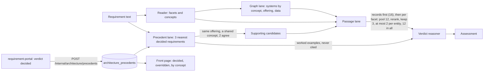

# Ontology plan, Phase 5 — Retrieval quality and monitoring

## Objective

Give the verdict reasoner better evidence, and learn from the decisions reviewers make. An
assessment's passages are reranked and kept within a budget per facet and per entity, so one
wordy need cannot crowd out the rest. Every verdict a Requirement Owner accepts or overrides
in requirement-portal comes back here as a **precedent**. The next assessment shows the
nearest decided requirements to the reasoner as worked examples. A knowledge admin sees,
per release, how often reviewers overrode the suggestion, and for which concepts.

## User Outcome

- **Analyst.** An assessment of "Offer a three-year commitment on the Business Pro Plus CPE
  rate plan" now names PSM and the Catalog Automation Framework too. Two decided
  requirements for the same offering, needing the same concept, changed both. Each system
  shows the path "Decided requirement G032 › PSM".
- **Knowledge admin.** The front page's architecture table shows, for the edition in force,
  "Suggested verdicts decided: 20" and "Of them changed: 3 (15%)". Its note says for which
  capabilities requirement owners changed the suggestion most often.
- **Requirement work.** It sends each decision to `POST /internal/architecture/precedents`,
  and passes the requirement's id when it assesses, so its own decision is never shown back
  to it.

## In Scope

- A reranker port, with three adapters: lexical BM25 (the default), the index's own order,
  and an HTTP cross-encoder (`RERANKER_PROVIDER=http`).
- The passage lane's budgets: per facet, per entity, in all, and for candidates' records.
- Precedents: the domain value, the store (in memory and PostgreSQL with pgvector), the
  internal route that receives them, and a summary route for knowledge admins.
- The precedent lane: the nearest decided requirements, shown to the reasoner, and the
  systems they agree on as supporting candidates.
- The evaluation's leave-one-out precedent mode, and its new floors.
- The front page: two totals and a note in the architecture table.

## Out of Scope

- requirement-portal's side: sending decisions through an outbox, and passing the
  requirement id. That is its own pull request, after this release.
- A screen listing precedents one by one: the summary shows counts only, never text.
- A live cross-encoder deployment. The HTTP adapter is ready; choosing and hosting the model
  is an operations decision.

## How an assessment uses them



### The passage lane's budgets

| Budget | Value | Why |
|---|---|---|
| Candidates' records | 16 | Primary systems first, then owners, channels, named, consumers, supporting |
| Pool per facet | 12 | What the reranker chooses from |
| Kept per facet | 3 | The plan's "about 3 passages per facet" |
| Kept per entity | 2 | One document or one catalogue record cannot fill a facet |
| Passages in all | 12 | Facets take turns, best first, so every facet gets its best passage |

Only need, data and interface facets are searched. A need linked to concepts searches the
passages linked to them; any other searched facet searches by its words.

### The precedent lane

Each decided precedent is scored by the cosine similarity of the two texts' embeddings, plus
0.2 times the overlap (Jaccard) of the concepts both needed. Those under 0.5 are left out,
and the best 3 are kept. A precedent lends its systems as **supporting** candidates only when:
- it is for the same offering as the assessment;
- it needed at least one of the same concepts;
- and at least 2 kept precedents agree on the system.

The reasoner then decides, with each candidate's own record in the evidence, as for any other
candidate. A precedent left unknown is counted, but never shown.

## Example

G031, "Offer a three-year commitment on the Business Pro Plus CPE rate plan with a lower monthly
fee", with every other golden case kept as an accepted verdict (fake models):

```text
precedent G032  score 0.534  new_plan  business-pro-plus  bcc, caf, ecm, in, psm   shares cap-product-catalogue
precedent G033  score 0.504  new_plan  business-pro-plus  bcc, bscs, caf, psm      shares cap-product-catalogue
bcc  primary     configure  … › Product catalogue, eligibility and pricing › Digital Catalog (BCC)
ecm  primary     configure  … › Product catalogue, eligibility and pricing › ECM
caf  supporting  configure  Decided requirement G032 › Catalog Automation Framework
psm  supporting  configure  Decided requirement G032 › PSM
```

Without precedents, the same assessment names BCC and ECM only. The label expects BCC, BSCS,
CAF and PSM.

A decision as requirement-portal sends it:

```json
{
  "precedent_id": "ANA-2041",
  "requirement_id": "REQ-1187",
  "version": "ANA-2041@3",
  "release_id": "smb-2026-10",
  "text": ["Offer a three-year commitment on the Business Pro Plus CPE rate plan."],
  "decision": "overridden",
  "decided_at": "2026-10-11T09:00:00Z",
  "suggested_verdict": "change_existing_offering",
  "verdict": "new_plan",
  "offering_id": "business-pro-plus",
  "concept_ids": ["cap-product-catalogue", "cap-billing"],
  "systems": [{"id": "bcc", "role": "primary", "change_type": "configure"}]
}
```

The answer is `201 {"precedent_id": "ANA-2041", "recorded": true, "dropped_systems": []}`.

## Domain

`domain/architecture/precedents.py`:
- `PrecedentDecision`: `accepted`, `overridden`, `unknown`.
- `Precedent`: the analysis id, requirement id, version, release, text (at most 4,000
  characters), suggested and decided verdicts, decision, offering, concepts (at most 40),
  systems (at most 60, each once, with role and change type kept as written), and when it was
  decided and received.
  - Accepted means the verdict is the suggested one. Overridden means another verdict.
    Unknown means no verdict.
  - `replaces`: a later decision, or the same moment with other content (a corrected
    delivery). An older decision arriving late changes nothing.
- `PrecedentSummary` and `summarise`: accepted, overridden and unknown per release, the
  override rate among the decided, and per concept the decided and overridden counts, most
  overridden first.

`assessment.py` gains the `precedent` path kind; the `supporting` role now also covers
systems reached through precedents.

## Application

- `ports/passage_reranker.py`: `PassageRerankerPort.rerank(query, passages)`.
- `ports/precedents.py`: `PrecedentRequest`, `PrecedentReceipt`, `PrecedentMatch` and
  `PrecedentStorePort` (`record`, `get`, `nearest`, `summaries`).
- `use_cases/precedents.py`:
  - `RecordPrecedent` refuses a release that is unknown or not published (404). It keeps only
    the systems, concepts and offering the release holds, and names the dropped systems in
    the receipt. It embeds the text with the evidence index's model.
  - `ReadPrecedentSummaries` needs a maintainer, and names each release and concept.
- `use_cases/assessment_lanes.py`: `passage_lane` with the budgets above, `precedent_lane`
  and `precedent_candidates`.
- `use_cases/assess_requirement.py`: runs the precedent lane, adds the supporting candidates,
  and passes the examples to the reasoner. The answer carries `precedents` and
  `reranker_model`.
- `use_cases/mapping_evaluation.py`: the mapper is asked with the case's id, and
  `SeedGoldenPrecedents` keeps every labelled case as an accepted verdict.

## Ports

`AssessmentQuery` gains `requirement_id`. `ArchitectureAssessment` gains `precedents` and
`reranker_model`. `VerdictContext` gains `precedents`. `PROMPT_VERSION` becomes
`requirement-assessment-v3`, since the reasoner's prompt now explains worked examples.

## Adapters

- `infrastructure/architecture/passage_reranking.py`:
  - `LexicalPassageReranker` (`lexical-bm25-v1`): BM25 over the passages given, without
    stopwords, ties kept in the index's order.
  - `IndexOrder` (`index-order`).
  - `HttpPassageReranker`: `RERANKER_API=rerank` posts `{model, query, documents, top_n}` and
    reads `results[].relevance_score`; `RERANKER_API=tei` posts `{query, texts}` and reads
    `[].score`. An error, or an answer that leaves a passage unscored, keeps the index's order.
- `verdict_reasoning.py`: the structured reasoner's payload has `worked_examples` (each
  requirement cut to 600 characters, its verdict, decision, offering and systems). The prompt
  says to weigh them, never cite them, and prefer the evidence where they disagree. The fake
  reasoner ignores them.
- `infrastructure/persistence/in_memory_precedents.py` and `postgres_precedents.py`. The
  migration `202610111000_precedents.sql` adds `architecture_precedents`, with the embedding as
  `vector(768)` and the model it was made with. `nearest` compares only vectors of the same
  model, and skips unknown decisions and the asking requirement's own.
- Settings: `RERANKER_PROVIDER` (`lexical`, `none`, `http`), `RERANKER_URL`, `RERANKER_MODEL`,
  `RERANKER_API` (`rerank`, `tei`), `RERANKER_API_KEY` and `RERANKER_TIMEOUT_SECONDS`
  (default 10). `http` needs an http(s) URL and a model. The key is kept out of debug traces.

## API

- `POST /internal/architecture/precedents` (service token): `201` when kept, `200` when the
  same or a later decision is already kept, `404` for a release that is not published, `422`
  for an inconsistent decision.
- `GET /architecture-knowledge/precedents/summary` (`knowledge_admin`): per release, newest
  decision first: the counts, the override rate, and the concepts. No requirement text.
- `contracts/knowledge-internal.openapi.json` changes additively: the new route,
  `requirement_id` on the assess query, `precedents` and `reranker_model` on its answer, the
  `precedent` path kind, and the prompt version. `contracts/knowledge-public.openapi.json` and
  the frontend's types are regenerated.

## UI

The front page's architecture table (`frontend/src/home/derive.ts`, `useOverview.ts`), for a
maintainer, once any decision against the edition in force exists:
- two more totals under "In the edition in force": **Suggested verdicts decided** and **Of
  them changed** (with the rate once 10 are decided; below that a rate says more about chance);
  when every suggestion was marked unknown, one row says so instead;
- the edition's note gains a sentence: "By 10 Oct 2026, requirement owners had decided 18
  verdicts suggested against this edition and changed 3, as often for requirements needing
  ‘Order fulfilment’ (2 of 3) as for ‘Order tracking’ (2 of 16). 1 other was marked unknown."
  Capabilities tied for the most changes are all named; among equal counts the one decided
  less often comes first.

The summary never holds the table back: until it answers, or if it fails, the table shows no
decision counts. Anyone else sees the table as before, and their refresh never asks for it.

The design critique (live seeded page, desktop and 390px) asked for these words: "suggestions"
already means a draft's catalogue suggestions on this table, so the totals say "suggested
verdicts" and "changed", and name who decided.

## Business Rules

- A precedent is kept per requirement analysis. The latest decision wins.
- A precedent never selects a system on its own. It offers a supporting candidate, and the
  reasoner selects it only with evidence, as for any candidate.
- A requirement never sees its own decision as an example.
- The summary counts decisions, never text, so a knowledge admin learns where the
  suggestions go wrong without reading requirements they are not a member of.

## Tests

- `tests/unit/test_precedents.py` (22): the invariants, `replaces`, the summary, recording
  (dropped systems, unknown release, late and repeated deliveries), the nearest search, the
  summaries' access rule, and both routes (401, 201, 200, 404, 422, 403).
- `tests/unit/test_passage_reranking.py` (13): lexical order, both HTTP shapes with a mock
  transport, five failures that keep the index's order, the settings checks, and the
  composition.
- `tests/unit/test_requirement_assessment.py` (+7): the per-facet and per-entity budgets, the
  turns between facets, the records' budget, precedent candidates and their paths, a
  precedent for another offering or need lending nothing, and the reasoner's worked examples.
- `tests/integration/test_postgres_precedents.py`: keep once, the later decision winning, and
  the pgvector search by model, decision and requirement.
- `tests/unit/test_mapping_evaluation.py`: the leave-one-out run's floors, with recall up and
  precision not down.
- `frontend/src/home/derive.test.ts` (+4): the totals and the note, tied capabilities and no
  rate on a handful, another release's decisions ignored, and the wording when every
  suggestion was marked unknown or none was changed.

## Acceptance Criteria

- Golden-set scores improve on Phase 3. **Met** with the fake models, below.
- The override rate is visible per release. **Met:** the summary route and the front page.
- Precision does not fall. **Met:** 73.7% without precedents, 74.2% with them.

## Validation Evidence

`LLM_PROVIDER=fake python -m knowledge_portal.interfaces.evaluate`, golden set v2, 59 cases:

| Measure | Phase 3 (53 cases) | Phase 8 | Phase 5, no precedents | Phase 5, leave-one-out |
|---|---|---|---|---|
| System precision | 65.2% | 73.7% | 73.7% | **74.2%** |
| System recall | 24.1% | 33.0% | 33.0% | **34.0%** |
| Verdict accuracy | 67.9% | 71.2% | 71.2% | 71.2% |
| Offering accuracy | 85.7% | 87.8% | 87.8% | 87.8% |
| Concept recall | 21.0% | 20.6% | 20.6% | 20.6% |
| Citation faithfulness | 100% | 100% | 100% | 100% |
| Owner and consumer reach | — | 100% | 100% | 100% |
| False changes | 5 | 5 | 5 | 5 |

Tuning, on the leave-one-out run:

| Rule | Precision | Recall |
|---|---|---|
| Score ≥ 0.5, 2 agree, same offering | 67.8% | 37.7% |
| Score ≥ 0.5, 3 agree | 73.2% | 33.5% |
| Score ≥ 0.6, 2 agree, concept weight 0.4 | 74.2% | 34.0% |
| **Score ≥ 0.5, 2 agree, a shared concept (chosen)** | **74.2%** | **34.0%** |

Text alone lent 12 right systems and 13 wrong ones across 11 cases: the wrong ones were
systems another need had changed (G004, G058 and G059 gained 1 to 3 each). Requiring a
shared concept keeps the gain on G031 (CAF and PSM) and drops every wrong one, at the cost
of the right ones on G002, G005, G017 and G027, whose precedents shared no linked concept
with them. Better concept linking (concept recall is 20.6%) is what wins those back.

## For review

- **Requirement text is now kept here.** A precedent keeps up to 4,000 characters of the
  requirement and its concepts, so the lane can compare and show it. ADR-0114 gains an
  amendment saying so (`docs/architecture/adr-0114-capability-concepts-select-systems.md`).
  Only the service token writes it, and only counts leave it.
- **Thresholds are tuned on fake embeddings.** The fake's cosine is lexical and low (0.5 to
  0.7 for close cases). Live embeddings score near texts higher, so 0.5 admits more. The
  shared concept and the agreement of two guard it. The live-model run should re-tune them.
- **The fake reasoner ignores examples**, so verdict accuracy cannot move with the fakes. The
  examples' effect on verdicts is for the live run.
- **The lexical reranker changes nothing with the fakes**: the fake reasoner selects by
  records, which come first. Its effect, and the cross-encoder's, is for the live run.

## Risks

- **Precedents echo mistakes.** An accepted wrong verdict becomes an example. The reasoner is
  told to prefer the evidence, and an overridden decision carries the reviewer's verdict.
- **Cold start.** Until requirement-portal sends decisions, the lane is empty and assessments
  are as in Phase 8.
- **Model change.** After the embedding model changes, earlier precedents are not compared
  until re-sent. Requirement-portal can re-send them; a re-embedding job is deferred.

## Deferred

- requirement-portal's outbox and assess change: its own pull request after v0.4.0.
- Re-embedding precedents after an embedding model change.
- A per-concept override view and a precedent list with its text for the requirement's own
  members.
- Hosting a cross-encoder, and the live-model run of Phases 3 to 5.
