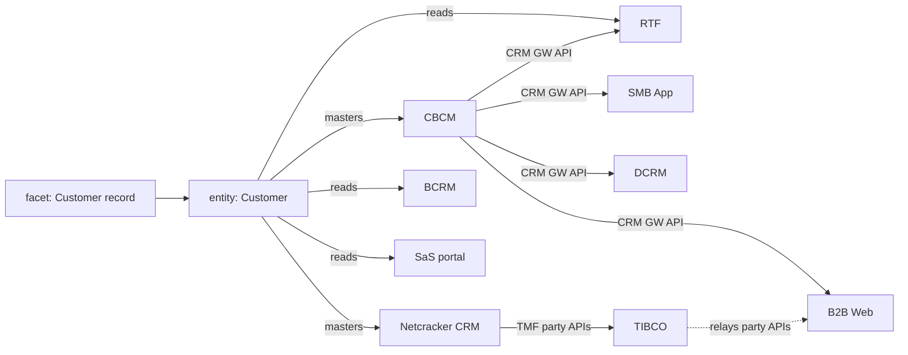

# Ontology plan, Phase 8 — Data entities and interfaces

## Objective

Let an assessment see what a data or contract change reaches beyond the system it changes. The
catalogue gains the information entities systems master or read, and the interfaces systems
expose and consume. An integration layer that passes another system's interface on records that
relay. A requirement that names data or an interface then reaches the systems of record, the
readers, and every consumer of the interfaces that carry it, through every layer that relays
them.

## User Outcome

A knowledge administrator can, in a draft, by the API or a catalogue file (YAML, JSON or Excel):
- add information entities to the vocabulary (a sixth scheme, `information_entity`);
- say which entities each system masters (is the system of record for) and which it reads;
- record each interface a system exposes: its style, its consumers, the Open APIs that do the
  same job, the entities it carries, and the interfaces it relays.

Every change shows in the draft's change list and the release comparison.

An analyst whose requirement says "keep the VAT number in the customer record" gets CBCM and
Netcracker CRM as **owners**, and B2B Web, SMB App, DCRM, RTF, TIBCO, BCRM and the SaS portal as
**consumers**, each with the path that reaches it.

## In Scope

- The domain: `SystemInterface`, data roles on `SystemDefinition`, the `information_entity`
  scheme, relays, and the ripple that follows them.
- The assessment: the `owner` and `consumer` roles, the `data` and `interface` facets resolved
  to release ids, and the `entity` and `interface` path steps.
- The diff, the catalogue file formats, the draft API, the evidence index and both OpenAPI
  contracts.
- `catalogues/smb-architecture.yaml`: 14 entities, data roles on 19 systems, and 42 interfaces
  with 4 relays.
- The golden set, version 2: 6 new cases labelled with owners and consumers, and a new
  "owner and consumer reach" score.
- Frontend: regenerated API types and the new names in today's change list and suggestion
  sentences.

## Out of Scope

Agreed split (decision card in the project thread): this is the first of two pull requests.
- **Second PR:** CFS, RFS and resource records, and the resources each realises.
- Screens to browse entities and interfaces: the redesign epic, through its gates.
- The explorer's read routes: unchanged, so `/explorer/*` serves no entities or interfaces yet.

## How a change ripples



- **Data.** A `data` facet names an entity. Its owners are the systems mastering it or a
  narrower entity (`entity_family`). Its readers are consumers. The consumers of every
  interface an owner exposes that carries the family are consumers too.
- **Interface.** An `interface` facet names an interface. The system exposing it is the owner,
  and its consumers are consumers.
- **Relays.** After the first interface, the change goes on only through an interface that
  relays the one it arrived by, up to 3 interfaces from the change (`MAX_HOPS`). Each system is
  reached once, by its shortest path.
- Data is not followed past the first interface on its own. A consumer that receives an order
  does not pass every order change on, and following it inflated the channels reached in G056
  and G057 during development.

| Role | Rank | Change type the fake reasoner gives |
|---|---|---|
| primary | 0 | from the wording |
| owner | 1 | from the wording |
| channel | 2 | from the wording |
| named | 3 | from the wording |
| consumer | 4 | `consume_only` |

When several lanes reach a system, it keeps the best-ranked role and every path.

## Example

G056, "Add the sub-order number to the NotifyOrderCreationRequest message…", assessed with the
fake models:

```text
facet interface if-ibm-bpm-notify-order-creation | NotifyOrderCreationRequest
facet interface if-tibco-notify-order-creation   | NotifyOrderCreationRequest
ibm-bpm owner    modify        NotifyOrderCreationRequest > IBM BPM
tibco   owner    modify        NotifyOrderCreationRequest > IBM BPM > NotifyOrderCreationRequest > TIBCO
rtf     consumer consume_only  … > TIBCO > NotifyOrderCreationRequest > RTF
```

## Domain

`domain/architecture/interfaces.py`:
- `InterfaceStyle`: `api`, `event`, `file`, `unspecified`.
- `SystemInterface(id, name, system_id, style, consumer_ids, open_api_ids, entity_ids,
  description, confidence, source, relays)`.
  - No consumer named twice, and the exposing system never consumes its own interface.
  - No relay named twice, and no interface relays itself.
- `check_interfaces`:
  - unique ids, and one name per exposing system;
  - catalogued systems;
  - Open API and entity terms from their own schemes;
  - each relayed interface exists and its relaying system consumes it.
- `check_data_roles`: masters and reads name entity terms, each once, never both for one system.

`domain/architecture/ripple.py`: `entity_family`, `data_owners`, `data_readers`,
`interface_owner` and `ripple`, each returning `Reach(system_id, steps)`.

Other domain changes:
- `vocabularies.py`: the `information_entity` scheme, with the id prefix `entity`.
- `knowledge.py`: `SystemDefinition.masters` and `.reads`, and `ArchitectureKnowledge.interfaces`.
- `assessment.py`: the `owner` and `consumer` roles, the `entity` and `interface` path kinds, and
  the `interface` facet. `data` and `interface` facets carry release ids.
- `diff.py`: `interface` changes, and `masters` and `reads` on systems.

## Application Use Cases

- `assessment_lanes.py`:
  - `catalogue_terms` lists entities by their labels, and interfaces by name and by
    "System name".
  - `graph_lane` runs the data lane after needs and channels.
- `architecture_index.py`: a system's evidence record gains "Masters", "Reads", "Exposes … to …,
  relaying … from …" and "Consumes … from …" lines, only when it has them, so other systems'
  text and chunk ids are unchanged.
- `mapping_evaluation.py`: a case may label `owner_ids` and `consumer_ids`. The report's `reach`
  is the share of them the mapper names, in any role.

## Ports

No new port. `CatalogueContent` gains `interfaces`. `CatalogueTerms` gains `entities` and
`interfaces`. `PROMPT_VERSION` becomes `requirement-assessment-v2`, since the reader's prompt now
explains data and interface facets.

## Adapters

- `catalogue_files.py`:
  - YAML and JSON: `masters` and `reads` on systems, and a top-level `interfaces` list (`id`,
    `name`, `system`, `style`, `consumers`, `open_apis`, `entities`, `description`,
    `confidence`, `source`, `relays`).
  - Excel: `masters` and `reads` columns on Systems, and an Interfaces sheet. Both are optional,
    so older workbooks still import.
- `requirement_reading.py`:
  - The fake reader names an entity only when a data word follows it ("customer record", "party
    data").
  - It names an interface only when the name is one camelCase word, says API, or is followed
    by a call word (API, call, callback, endpoint, event, message).
  - A name inside a longer one the text names ("Order" in "Service order API") names nothing.
  - The structured reader's prompt and catalogue payload include both lists.
- `verdict_reasoning.py`: the prompt explains the two roles. The fake reasoner gives a
  consumer `consume_only`.
- `golden_set_file.py`: optional `owners` and `consumers`, within the case's systems and never
  overlapping.

Persistence stores the release whole, so it needs no migration.

## API

- Release responses carry `interfaces`, and systems carry `masters` and `reads`.
- `PUT /architecture-knowledge/releases/{id}` takes `interfaces`. Omitting it keeps the draft's
  own.
- All of these require `knowledge_admin`. `contracts/knowledge-public.openapi.json` is
  regenerated.
- `contracts/knowledge-internal.openapi.json` changes only additively:
  - the enum values `owner`, `consumer`, `entity`, `interface` (path kind) and `interface`
    (facet kind);
  - the new prompt version default.
- requirement-portal's assess client parses these tolerantly (confirmed in the main sequence
  thread). They ship in the release after 0.3.0.

## UI

No new screen. Today's UI only adapts: the change list names "interfaces", and a vocabulary
suggestion can name an "information entity".

## Business Rules

- Only curated records ripple: masters, reads, consumers and relays. Nothing is inferred from
  journeys or documents.
- A system of record does not also read its own data.
- A relay is recorded on the relaying system's interface, and that system must consume what it
  relays.
- A consumer is reached at most 3 interfaces from the change.

## Tests

- `tests/unit/test_data_and_interfaces.py` (23):
  - interface invariants, and the release's checks on interfaces and data roles;
  - the ripple:
    - owners, readers, consumers and a relayed consumer, with exact paths;
    - a broader entity reaching a narrower entity's owner;
    - an interface change reaching only through itself;
  - the lanes' roles and paths, and the catalogue terms;
  - the fake reader naming data and interfaces only as written, and dropping a nested name;
  - the round trip in all three file formats;
  - the diff;
  - the draft API: stored, kept when omitted, and an unconsumed relay refused with 422.
- `test_mapping_evaluation.py`:
  - the golden reader refusing owners outside a case's systems, or a system as both owner and
    consumer;
  - Phase 3's floors on the first 53 cases;
  - Phase 8's floors on all 59.
- `test_catalogue_portfolio_and_integrations.py` reads the committed catalogue with its
  interfaces. `test_catalogue_files.py` lists the new sheet.

## Acceptance Criteria

- Information entities, data roles and interfaces in the catalogue, the API and every file
  format. **Met.**
- An assessment names owners and consumers with the path to each. **Met.**
- Every labelled owner and consumer in the golden set is reached. **Met** with the fake models:
  owner and consumer reach is 100%.
- Phase 3's results are unchanged. **Met:** on the 53 v1 cases, precision 65.2%, recall 24.1%,
  verdict 67.9%.

## Validation Evidence

Run on 2026-10-10 on `claude/ontology-phase-8-data-apis-3eqjqx`, based on main (`c1542a9`).

```text
$ pytest tests/unit/test_data_and_interfaces.py
23 passed
$ pytest                  # whole suite; PostgreSQL tests skip without TEST_DATABASE_URL
1021 passed, 49 skipped in 91.79s
$ ruff check . && ruff format --check .
All checks passed!
$ mypy src tests
Success: no issues found in 338 source files
$ lint-imports
Contracts: 10 kept, 0 broken.
$ cd frontend && npm run typecheck && npm run lint && npx vitest run && npm run build && npm run api:check
Test Files 38 passed (38), Tests 287 passed (287); built
```

`LLM_PROVIDER=fake python -m knowledge_portal.interfaces.evaluate`, golden set v2, 59 cases:

| Measure | Assess | Match (today's per-item) |
|---|---|---|
| System precision | 73.7% | 82.8% |
| System recall | 33.0% | 11.3% |
| Verdict accuracy | 71.2% | 52.5% |
| Offering accuracy | 87.8% | 75.6% |
| Concept recall | 20.6% | not measured |
| Citation faithfulness | 100% | 100% |
| Owner and consumer reach | 100% | 32.0% |
| False changes | 5 | 5 |

## For review

- **The seeded records are proposals** (`confidence: inferred`):
  - The 14 entities are SID aggregate business entities: Party, Customer, Billing account, Bill,
    Product offering, Product, Product order, Order milestone (under Product order), Service
    order, Resource, Telephone number (under Resource), Work order, Trouble ticket and
    Customer document.
  - The data roles, such as CBCM mastering Customer, Billing account and Product, and
    Netcracker CRM mastering Party and Customer, are read from the journeys and system
    descriptions.
  - The 42 interfaces come from the journeys' integrations.
  - The 4 relays are all TIBCO's: the party APIs, NotifyOrderCreationRequest, the milestone
    updates and the order details.
- **Two systems master Customer** (CBCM and Netcracker CRM), since the journeys write customer
  data to both. Please confirm which is the system of record today.
- **One name, two interfaces.** TIBCO's NotifyOrderCreationRequest has IBM BPM's name, so a
  requirement naming it reads as both, and TIBCO is named an owner where the label says
  consumer. Reach counts it, since the system is named.

## Risks

- **Labels and links share an author.** The same person wrote the catalogue's data roles and
  the new cases' labels, so the 100% reach may flatter. Live-model runs and cases labelled by
  someone else are the real test.
- **G058 names NPC**, through the concept lane, where the label does not.
- **Over-reach.** A widely read entity such as Customer reaches nine systems. A reviewer must
  be able to drop consumers a change does not really touch.

## Dropped from this slice

- Following an entity through every interface that carries it, past the first: replaced by
  explicit relays.

## Deferred

- CFS, RFS and resource records: the second PR.
- A backfill that suggests interfaces from the journeys' integrations, as reviewable
  suggestions.
- Screens for entities, interfaces and relays, and the explorer's read routes: the redesign
  epic.
- Explaining today's per-item match's systems through entity and interface paths.
- Squad owners for owner-role systems.
