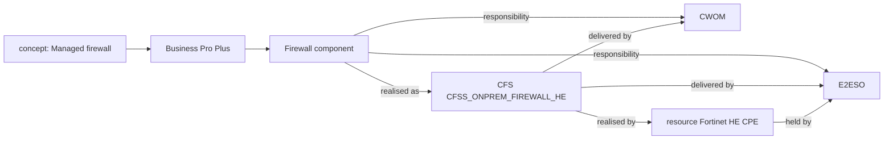

# Ontology plan, Phase 8 (part 2): CFS, RFS and resource records

## Objective

Make what a component is realised as into catalogue records of their own: customer-facing
services (CFS), resource-facing services (RFS) and resources. Before this change, a component's
realisation was only a layer and a name. A record gives that name an id, the systems that deliver
or hold it, and what realises it one layer down. The graph lane can then walk from a component
through its records to their systems.

This is the second of the two Phase 8 pull requests agreed in the project thread. The first
(`docs/slices/ontology-phase-8-data-and-interfaces.md`, PR #71) added information entities,
interfaces and relays.

## User Outcome

A knowledge administrator can, in a draft, by the API or a catalogue file (YAML, JSON or Excel):
- add CFS, RFS and resource records, each with:
  - other names;
  - the systems that deliver it;
  - the records one layer down that realise it;
- link each realisation a component lists to the record it means. The name the source wrote
  stays as written.

Every change shows in the draft's change list and the release comparison.

An assessment then explains a system through the records as well. For example, Business Pro
Plus's Firewall component reaches E2ESO this way:

```text
Managed firewall > Business Pro Plus > Firewall > CFSS_ONPREM_FIREWALL_HE > Fortinet HE CPE > E2ESO
```

## In Scope

- The domain:
  - `RealisationRecord`, `check_realisations` and `realisation_chains`;
  - `Realisation.record_id`;
  - `ArchitectureKnowledge.realisations`.
- The graph lane: `realisers` follows a component's records down their chains. Paths gain the
  step kind `realisation`.
- The diff, every catalogue file format, the draft API, the evidence index, and both OpenAPI
  contracts.
- Document readings keep a component's record links where the layer and name are unchanged.
- `catalogues/smb-architecture.yaml`: 4 CFS and 2 resource records, linked from the six
  Business Pro Plus components whose technical spec names one.
- Frontend: regenerated API types, and the change list's name for the new item.

## Out of Scope

- Screens to browse and edit records: the redesign epic, through its gates.
- The explorer's read routes: unchanged.
- A clean-up that suggests records from the components' technical specs: deferred, as for
  interfaces.

## How records are followed



- A CFS is realised by RFSs or resources, and an RFS by resources. A resource is realised by
  nothing. Because each step goes down a layer, a chain has no cycles and is at most three
  records long.
- For each record a component is realised as, `realisers` adds one path per record in each
  chain and per system of that record. Each path names the records walked through.
- The paths join those the responsibilities already give. A system keeps its role and every
  path, so the role and verdict rules are unchanged.

## Domain

`domain/architecture/realisations.py`:
- `RealisationRecord(id, layer, name, aliases, system_ids, realised_by, description, confidence,
  source)`:
  - its names differ from each other;
  - no system and no realising record is named twice;
  - it is never realised by itself;
  - a resource is realised by nothing.
- `check_realisations`:
  - unique ids;
  - each name or alias names one record **within its layer**, so a CFS and a resource may share
    a name;
  - catalogued systems;
  - records realised only by a lower layer;
  - each component realisation's `record_id` names a record of its own layer.
- `realisation_chains`: each chain from a record down through what realises it.

Other domain changes:
- `products.py`: `Realisation.record_id`.
- `impact_graph.py`: `realisers` follows records.
- `assessment.py`: `PathKind.REALISATION`.
- `diff.py`: `realisation` changes. A component's re-linked record shows as its offering's
  `realisation` field.
- `vocabulary_links.py`: `kept_component_terms` keeps record links by layer and name.

## Application, ports and adapters

- `CatalogueContent` gains `realisations`. `ManageArchitectureKnowledge.update` and file imports
  pass them on.
- `architecture_index.py`: a linked realisation's evidence line names the systems delivering the
  record and the records realising it one layer down, with their own systems. For example:
  "Firewall is realised by the customer-facing service CFSS_ONPREM_FIREWALL_HE (CWOM, E2ESO), on
  the resource Fortinet HE CPE (E2ESO)". An unlinked line keeps its text.
- `catalogue_files.py`:
  - YAML and JSON: a top-level `realisations` list (`id`, `layer`, `name`, `aliases`,
    `systems`, `realised_by`, `description`, `confidence`, `source`), and a `record` key on a
    component's realisation entries.
  - Excel: a RealisationRecords sheet, and a `record_id` column on the Realisation sheet. Both
    are optional, so older workbooks still import.

Persistence stores the release whole, so it needs no migration.

## API

- Release responses carry `realisations`, and each component realisation carries `record_id`.
- `PUT /architecture-knowledge/releases/{id}` takes `realisations`. Omitting it keeps the
  draft's own.
- All of these require `knowledge_admin`. `contracts/knowledge-public.openapi.json` is
  regenerated.
- `contracts/knowledge-internal.openapi.json` changes by one additive enum value: the
  `realisation` path kind. requirement-portal parses path kinds tolerantly, as confirmed for
  Phase 8's first part.

## Catalogue data

| Record | Layer | Systems | Realised by | Linked from |
|---|---|---|---|---|
| CFSS_INTERNET_CPE_ONPREM_HE | CFS | CWOM, E2ESO | Fortinet HE CPE | GPON |
| CFSS_ONPREM_FIREWALL_HE | CFS | CWOM, E2ESO | Fortinet HE CPE | Firewall |
| CFSS_SELFSERVICE_PORTAL_ACCESS | CFS | E2ESO | — | Self-service portal |
| CFSS_SDWAN_NEW | CFS | CWOM | — | SD-WAN |
| Fortinet HE CPE (Fortinet 90G, Fortinet 120G) | resource | E2ESO | — | CPE device |
| FortiAP (PRS_ACCESS_POINT) | resource | CWOM | — | Access point |

All are `confidence: inferred`, from the components' technical specs and descriptions
(SDD v2.3 §P1). The sources name no RFS by name, so none is seeded.

## Tests

- `tests/unit/test_realisation_records.py` (18):
  - record invariants;
  - the release's checks, including a link to a record of the wrong layer;
  - a name shared across layers;
  - the chains;
  - the graph lane's paths through a CFS, an RFS and a resource;
  - a re-read component keeping its record, and losing it when renamed;
  - the evidence line;
  - the round trip in all three file formats;
  - the diff;
  - the draft API: stored, kept when omitted, a wrong-layer link refused with 422;
  - the committed catalogue's links.
- `test_catalogue_files.py` lists the new sheet. The committed-catalogue and pgvector tests
  pass the records.

## Acceptance Criteria

- First-class CFS, RFS and resource records beside the name strings in `Realisation`. **Met.**
- The graph lane follows them. **Met**, with paths through each record.
- No score falls. **Met**:
  - with the fake models, golden set v2 scores exactly as after part 1;
  - the records' systems already deliver the components through their responsibilities, so they
    add paths, not new systems.

## Validation Evidence

Run on 2026-10-11 on `claude/ontology-phase-8-data-apis-3eqjqx`, based on main (`be22bea`).

```text
$ pytest tests/unit/test_realisation_records.py
18 passed
$ TEST_DATABASE_URL=… pytest      # whole suite, PostgreSQL tests included
1088 passed
$ ruff check . && ruff format --check .
All checks passed!
$ mypy src tests
Success
$ lint-imports
Contracts: 10 kept, 0 broken.
$ cd frontend && npm run typecheck && npm run lint && npx vitest run && npm run build && npm run api:check
Test Files 38 passed (38), Tests 287 passed (287); built
$ LLM_PROVIDER=fake python -m knowledge_portal.interfaces.evaluate
system precision 73.7% · recall 33.0% · verdict 71.2% · offering 87.8% · concepts 20.6% ·
citations 100% · owner and consumer reach 100% (unchanged)
```

## For review

- **The six records are proposals.** Please check:
  - **Systems:** whether CWOM and E2ESO are the right delivering systems.
  - **RFSs:** whether the SDD's RFSs should be added. "NP RFS" appears only as a message name.
  - **Same service?** Whether CFSS_INTERNET_CPE_HE, which the modify journeys name, is the same
    CFS as CFSS_INTERNET_CPE_ONPREM_HE. If it is, it should be an alias.
- **The CPE component's spec is a rate plan.** RPCUSTONPREMEQPT is not a resource, so the CPE
  device is linked to the resource by its description instead.

## Risks

- **Thin data.** Six records give the graph little new reach. Records pay off as more offerings
  name their services, and the lane's precision must be re-checked then.

## Deferred

- A clean-up that suggests records from technical specs and document readings, as reviewable
  suggestions.
- Screens for records, and the explorer's read routes: the redesign epic.
- Squad owners for owner-role systems, and explaining today's per-item match through entity,
  interface and record paths (from part 1).
